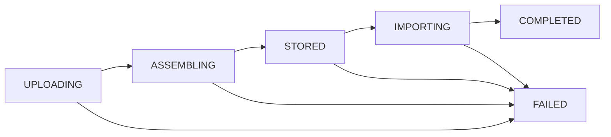

출근 10:10
- 오늘은 보안 공부는 한 문제만 풀고 KMAP 개발에 전념할 듯

# H5AD 파일 스토리지 아키텍처 설계 제안

### 1. 현재 상태 분석
| 기능 | 상태 | 위치 |
| :--: | :--: | :--: |
| 파일 업로드 | ❌ 미구현 | - |
| 파일 다운로드 | ❌ 501 Not Implemented | `backend/app/api/datasets.py:87` |
| H5AD 임포트 | ✅ 서버 경로 기반 | `backend/app/services/importer.py` |
| file_storage_path | ✅ 문자열 메타데이터만 | `backend/app/models/dataset.py` |
##### 현재 워크플로우:
관리자가 서버에 파일 수동 배치 → `/sc/admin/import` API에 서버 경로 전달 → PostgreSQL에 파싱 데이터 저장 (원본 파일 미보관)

### 2. 아키텍처 개요

#### 2.1 시스템 구조도
```tree
Admin Page (React+Vite)              Public Frontend (React)
  └─ Chunked Upload UI                └─ Download Links
         │                                    │
         │ POST multipart/form-data           │ GET streaming
         ▼                                    ▼
┌─────────────────────────────────────────────────────┐
│              FastAPI Backend                        │
│                                                     │
│  /api/v1/files/upload/init        ← 업로드 초기화     │
│  /api/v1/files/upload/{id}/chunk  ← 청크 업로드      │
│  /api/v1/files/upload/{id}/complete ← 조립 완료      │
│  /api/v1/files/{uuid}/download    ← 스트리밍 다운로드 │
│  /api/v1/files/{uuid}/import      ← H5AD 임포트 연결 │
│                                                     │
│  ┌───────────────────────────────────────────────┐  │
│  │         FileStorageService (Orchestrator)     │  │
│  │  init_upload → upload_chunk → complete_upload │  │
│  │  stream_download / trigger_import             │  │
│  └──────────────────┬────────────────────────────┘  │
│                     │                               │
│          ┌──────────┴──────────┐                    │
│          │  StorageBackend ABC │ ← 추상화 인터페이스  │
│          └──────────┬──────────┘                    │
│       ┌─────────────┼─────────────┐                 │
│       ▼             ▼             ▼                 │
│  LocalStorage   S3Backend    MinIOBackend           │
│  (MVP)          (미래)       (미래)                  │
└─────────────────────────────────────────────────────┘
         │                         │
    ┌────┴─────┐             ┌─────┴───────┐
    │  Docker  │             │PostgreSQL   │
    │  Volume  │             │file_metadata│
    │ /data/   │             │  table      │
    │h5ad_files│             └─────────────┘
    └──────────┘
```

#### 2.2 로컬 파일 디렉토리 구조
```tree
/data/h5ad_files/              ← Docker named volume
├── chunks/                    ← 업로드 중 임시 청크
│   └── {upload_id}/
│       ├── chunk_000000
│       ├── chunk_000001
│       └── ...
└── files/                     ← 조립 완료된 최종 파일
    └── {ab}/                  ← storage_key 앞 2자로 디렉토리 샤딩
        └── {storage_key}.h5ad

```

### 3. 핵심 컴포넌트 설계

#### 3.1 Storage 추상화 레이어
MVP에서는 `LocalStorageBackend`만 구현.
같은 인터페이스로 S3/MinIO 교체 가능.
```python
class StorageBackend(ABC):
    store_chunk(upload_id, chunk_index, data)       # 청크 1개 저장
    assemble_chunks(upload_id, total, final_key)    # 청크 → 최종 파일 조립
    delete_chunks(upload_id)                        # 임시 청크 정리
    read_stream(key, offset, length)                # 스트리밍 읽기 (Range 지원)
    get_file_info(key) → StorageFileInfo            # 파일 메타데이터 조회
    delete_file(key)                                # 파일 삭제
    get_local_path(key) → str | None                # 로컬 경로 반환 (S3는 None)
```

#### 3.2 DB 스키마: `file_metadata` 테이블
```sql
CREATE TYPE file_status_enum AS ENUM (
    'uploading', 'assembling', 'stored', 'importing', 'completed', 'failed', 'deleted'
);

CREATE TABLE file_metadata (
    id                SERIAL PRIMARY KEY,
    file_uuid         UUID UNIQUE NOT NULL,
    original_filename VARCHAR(500) NOT NULL,
    storage_key       VARCHAR(255) UNIQUE,          -- 조립 완료 후 설정
    size_bytes        BIGINT,
    checksum_sha256   VARCHAR(64),
    content_type      VARCHAR(100) DEFAULT 'application/x-hdf5',
    status            file_status_enum NOT NULL DEFAULT 'uploading',

    -- 업로드 진행 추적
    total_chunks      INTEGER,
    uploaded_chunks   INTEGER DEFAULT 0,
    upload_id         VARCHAR(255) UNIQUE,

    -- 관계
    uploader_id       INTEGER REFERENCES users(user_id) NOT NULL,
    dataset_id        INTEGER REFERENCES datasets(dataset_id),
    sc_dataset_id     INTEGER REFERENCES sc_datasets(id),

    -- 에러
    error_message     VARCHAR(1000),

    -- 타임스탬프
    created_at        TIMESTAMP DEFAULT now(),
    updated_at        TIMESTAMP DEFAULT now(),
    completed_at      TIMESTAMP
);
```
##### 상태전이:


#### 3.3 API 엔드포인트
| Method | Path | Auth | 설명 |
| :--: | :--: | :--: | :--: |
| `POST` | `/api/v1/files/upload/init` | Admin | 업로드 세션 초기화, `upload_id` 반환 |
| `POST` | `/api/v1/files/upload/{upload_id}/chunk` | Admin | 청크 1개 업로드 (multipart/form-data) |
| `POST` | `/api/v1/files/upload/{upload_id}/complete` | Admin | 청크 조립 + SHA-256 검증 |
| `DELETE` | `/api/v1/files/upload/{upload_id}` | Admin | 업로드 취소/중단 |
| `GET` | `/api/v1/files/{file_uuid}` | Admin | 파일 메타데이터 조회 (상태, 진행률) |
| `GET` | `/api/v1/files/{file_uuid}/download` | Optional | 스트리밍 다운로드 (HTTP Range 지원) |
| `DELETE` | `/api/v1/files/{file_uuid}` | Admin | 파일 삭제 |
| `POST` | `/api/v1/files/{file_uuid}/import` | Admin | H5AD 임포트 트리거 |

#### 3.4 업로드 플로우
```
1. POST /files/upload/init
   요청: { filename: "pbmc3k.h5ad", file_size: 52428800, chunk_size: 5242880 }
   응답: { upload_id, file_uuid, total_chunks: 10 }

2. POST /files/upload/{upload_id}/chunk  (× N번 반복)
   요청: FormData { chunk_index: 0, file: <blob> }
   응답: { uploaded_chunks: 1, total_chunks: 10 }

3. POST /files/upload/{upload_id}/complete
   요청: { checksum_sha256: "abc..." }  (선택)
   서버: 청크 조립 → SHA-256 검증 → 임시 청크 삭제
   응답: { file_uuid, status: "stored", size_bytes, checksum_sha256 }

4. POST /files/{file_uuid}/import
   요청: { dataset_name: "pbmc3k", import_expression: false, n_top_genes: 100 }
   서버: get_local_path() → H5ADImportService.import_dataset() 호출
   응답: { success: true, n_cells: 2700, n_genes: 3000 }
```

#### 3.5 다운로드 플로우
- `GET /files/{file_uuid}/download` → `StreamingResponse`
- HTTP Range 헤더 지원 (대용량 파일 부분 다운로드, 이어받기)
- `Content-Disposition: attachment; filename="원본파일명.h5ad"`
- 기존 `datasets.py`의 501 stub을 이 시스템으로 연결

#### 3.6 기존 H5ADImportService 연동 방식
**기존 코드 변경 없음.**
`H5ADImportService.import_dataset()`은 그대로 유지.
```python
FileStorageService.trigger_import()
  -> storage.get_local_path(storage_key)   # 로컬 절대 경로 획득
  -> H5ADImportService.import_dataset(db, h5ad_path=local_path, ...)
```
S3 전환 시: `get_local_path()` → `None` → 임시 파일 다운로드 후 임포트 → 임시 파일 삭제

### 4. Config / Docker / 의존성 변경

#### Config 추가 (`backend/app/core/config.py`)
```python
FILE_STORAGE_BACKEND: str = "local"
FILE_STORAGE_LOCAL_PATH: str = "/data/h5ad_files"
FILE_UPLOAD_MAX_SIZE_MB: int = 10240         # 10GB
FILE_UPLOAD_CHUNK_SIZE_MB: int = 5           # 5MB 기본 청크
```

#### Docker Volume 추가 (`docker-compose.yml`)
```yml
services:
  backend:
    volumes:
      - h5ad_storage:/data/h5ad_files

volumes:
  h5ad_storage:
    driver: local
```

#### Python 의존성 추가 (`requirements.txt`)
```
aiofiles>=23.0.0
```

### 5. 보안 고려사항
| 항목 | 방법 |
| :---: | :---: |
| 업로드 인증 | Admin JWT 필수 (`get_admin_user`) |
| 다운로드 인증 | 공개 데이터셋은 인증 없이, 비공개는 JWT 필요 |
| 파일 검증 | `.h5ad` 확장자 제한 + HDF5 매직넘버(`\x89HDF\r\n\x1a\n`) 확인 |
| 크기 제한 | `FILE_UPLOAD_MAX_SIZE_MB` 설정으로 init 시점에 차단 |
| 경로 탐색 방지 | `resolve().relative_to()` 검증 |
| 만료 업로드 정리 | 24시간 초과 미완료 업로드 자동 삭제 |

### 6. 파일 변경 목록

#### 새로 생성
| 파일 | 용도 |
| :---: | :---: |
| `backend/app/services/storage/__init__.py` | 스토리지 패키지 |
| `backend/app/services/storage/base.py` | `StorageBackend` ABC |
| `backend/app/services/storage/local.py` | 로컬 파일시스템 구현체 |
| `backend/app/services/file_storage.py` | 오케스트레이터 서비스 |
| `backend/app/models/file_metadata.py` | `FileMetadata` SQLAlchemy 모델 |
| `backend/app/schemas/file.py` | Pydantic 요청/응답 스키마 |
| `backend/app/api/files.py` | API 라우터 |
| `backend/app/core/storage.py` | 스토리지 팩토리 + FastAPI 의존성 |
| `backend/alembic/versions/xxxx_add_file_metadata.py` | DB 마이그레이션 |
| `admin-page/src/services/fileUpload.ts` | 청크 업로드 클라이언트 |
| `admin-page/src/components/FileUpload/H5adUploader.tsx` | 업로드 UI 컴포넌트 |

#### 수정
| 파일 | 변경 내용 |
| :---: | :---: |
| `backend/app/core/config.py` | `FILE_STORAGE_*` 설정 추가 |
| `backend/app/core/dependencies.py` | `get_storage_backend` 의존성 추가 |
| `backend/app/main.py` | files 라우터 마운트, 스토리지 초기화 |
| `backend/app/api/datasets.py` | 501 stub → 실제 다운로드 구현으로 교체 |
| `backend/requirements.txt` | `aiofiles` 추가 |
| `docker-compose.yml` | `h5ad_storage` 볼륨 추가 |
| `docker-compose.prod.yml` | 프로덕션 볼륨 추가 |

### 7. TODO (구현 순서)

#### Phase 1: 스토리지 기반 (Backend)
- [ ]  `aiofiles` 의존성 추가 (`requirements.txt`)
- [ ]  `StorageBackend` ABC 작성 (`services/storage/base.py`)
- [ ]  `LocalStorageBackend` 구현 (`services/storage/local.py`)
- [ ]  파일 스토리지 설정 추가 (`core/config.py`)
- [ ]  스토리지 팩토리 + 의존성 작성 (`core/storage.py`, `core/dependencies.py`)
- [ ]  Docker 볼륨 설정 (`docker-compose.yml`, `docker-compose.prod.yml`)

#### Phase 2: DB + 모델
- [ ]  `FileMetadata` 모델 작성 (`models/file_metadata.py`)
- [ ]  `models/__init__.py`에 등록
- [ ]  Alembic 마이그레이션 생성 및 실행

#### Phase 3: 업로드 API
- [ ]  Pydantic 스키마 작성 (`schemas/file.py`)
- [ ]  `FileStorageService` 오케스트레이터 작성 (`services/file_storage.py`)
- [ ]  업로드 API 엔드포인트 구현 (`api/files.py`: init, chunk, complete)
- [ ]  `main.py`에 라우터 마운트

#### Phase 4: 다운로드 API
- [ ]  스트리밍 다운로드 + Range 지원 구현 (`api/files.py`)
- [ ]  기존 `api/datasets.py` 501 stub 교체

#### Phase 5: 임포트 연동
- [ ]  `FileStorageService.trigger_import()` 구현
- [ ]  `/files/{uuid}/import` 엔드포인트 구현
- [ ]  기존 `H5ADImportService`와 통합 테스트

#### Phase 6: Admin 프론트엔드
- [ ]  청크 업로드 서비스 작성 (`admin-page/src/services/fileUpload.ts`)
- [ ]  업로드 UI 컴포넌트 작성 (`H5adUploader.tsx`: 드래그앤드롭, 프로그레스바)
- [ ]  DatasetsPage에 업로드 기능 통합
- [ ]  업로드 완료 후 임포트 트리거 UI

#### Phase 7: 검증 및 안정화

- [ ]  HDF5 매직넘버 헤더 검증 로직 추가
- [ ]  만료 업로드 자동 정리 (백그라운드 태스크)
- [ ]  다운로드 rate limiting (Redis)
- [ ]  E2E 테스트 작성

---

우선 위처럼 파일 아키텍처를 설계하긴 했으나 좀 더 회의가 필요할 듯

추가로 누구님께서 의뢰하신 랜덤키링 공장도 만듦
우선 임시로 연구실 컴에서 8888포트로 호스팅 중인데 추후에 변동될 수 있음

### 오늘의 메모
---
으아 힘들다...
공부도 해야 하는데...

퇴근 18:00