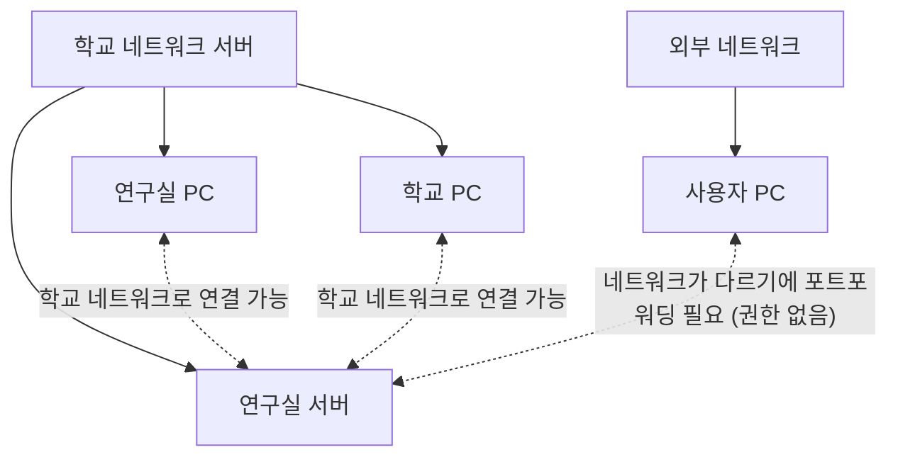

출근 10:10
- 오늘은 총학을 마무리 짓고 싶음..

우선 오늘 KMAP 테스트용 서버를 받음
너무 행복해서 총학 웹사이트를 올려봄
그런데

대충 이런 상황이기에
학교 와이파이에 연결되어있는 다른 기기들은 접속할 수 있지만 다른 네트워크에 기기들은 접속이 불가능하는 것을 발견함
테스트로 올려본 것이기에 다시 서버파일을 내리고 다른 테스트 서버 환경을 구축하기로 함

다같이 모여서 회의를 진행함
우선 어드민 로그인 관련된건 마무리 짓고 파일을 구글드라이브에 임시로 연결시켜버리기로 함
이걸 빨리 연결시켜서 넘겨줘야 업로드 팀도 구현을 시작할 듯

### 오늘의 메모
---
그래도 오늘 진짜 뭐라도 알차게 보낸 것 같다
내일은 더 해야지
근데 슬슬 감기기운이 있는 것 같다
기숙사 들어가서 약먹고 뻗어야겠다

퇴근 18:10