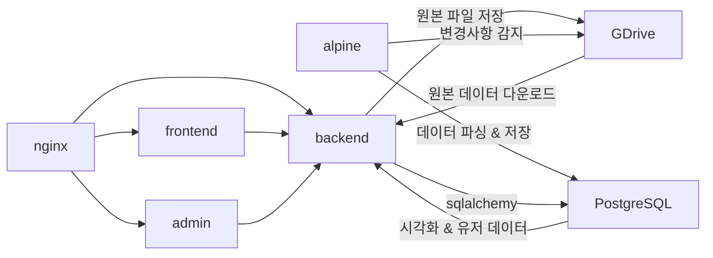
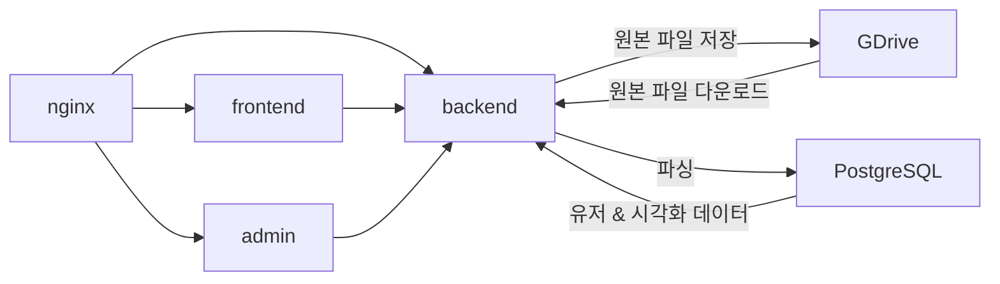

출근 9:50
- 오늘은 서브 프로젝트 하나를 시작하고 kmap도 조금 작업할 예정

우선 [PR](https://github.com/cxinsys/kmap/pull/86)을 하나 올리셨음
이거 읽어보고 CR을 달거임
함 어찌저찌
우선 파일 아키텍쳐 관해서 이야기를 좀 나눔
이거 확정되면 정말 좋겠다는 생각(?)
![[Pasted image 20260212161918.png]]
### 제안

### 현황

이 외에도 다양한 작업들을 했음

### 오늘의 메모
---
총학 결과가 어떻게 나온 지 몰라서 그냥 다시 계속 기다리는 수 밖에 없을 듯...

퇴근 18:05