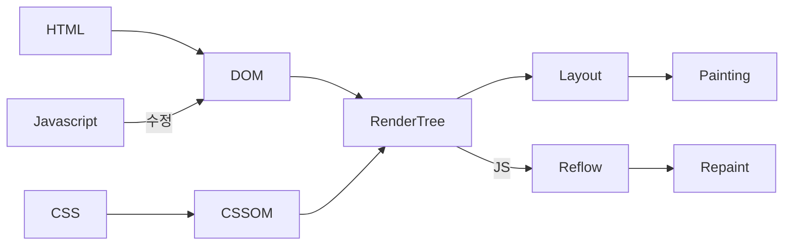

출근 10:20
- 오늘은 총학 웹 포탈 분석 위주로 할 예정
- 분석 하다가 React 공부할 듯
- 그래서 오늘은 웹 포탈 분석하는 폴더에 쓸거임
- 이따가 React 부분만 여기에 쓸듯

점심 먹고 돌아왔으니 이제부턴 React 공부할거임

```js
function add(a, b, callback) {
	setTimeout(() => {
		const sum = a + b;
		callback(sum);
	}, 3000);
}
add(1, 2, (value) => {
	console.log(value);
});
```
비동기 함수 내부의 변수를 외부에서 활용하려면 콜백함수를 활용하면 된다

하지만 이런 비동기 작업이 중첩되게 되면 흔히 말하는 `callback 지옥`에 시달리게 될 수 있다
이 문제를 해결하기 위해 `Promise` 객체를 활용할 수 있다
> [!check] Promise 객체
> `Promise` 객체 안에 여러 개의 비동기 작업을 실행, 관리할 수 있다.
> > [!abstract] 효과
> > - 비동기 작업 실행
> > - 비동기 작업 상태 관리
> > - 비동기 작업 결과 저장
> > - 비동기 작업 병렬 실행
> > - 비동기 작업 다시 실행
> > - 기타 등등..
> 
> ```mermaid
> graph LR
> Pending -- resolve --> Fulfilled
> Pending -- reject --> Rejected
> ```
> `Pending` : 아직 작업이 완료되지 않은 상태
> `Fulfilled` : 비동기 작업이 성공적으로 마무리 된 상태
> `Rejected` : 비동기 작업이 실패한 상태

```js
const promise = new Promise((resolve, reject) => {
	setTimeout(() => { // executor
		console.log("hello");
		resolve("result") // 결과 값과 함께 성공 상태로 전환
		//reject("result") // 실패 이유와 함께 실패 상태로 전환
	}, 2000);
});
console.log(promise);
promise.then((value) => { // 비동기 작업이 성공했을 때 resolve 값을 받아와서 실행되는 함수
	console.log(value)
}).catch((error) => { // 비동기 작업이 실패했을 때 reject 값을 받아와서 실행되는 함수
	console.log(error);
}); // 따로 쓸 수도 있지만 이렇게 연결해서 쓰는 것을 chaining이라고 씀
```
`Promise` 객체의 기능 중 하나로 `then` 안에서 새로운 `promise` 객체를 `return`하면 그 새로운 값이 `then`의 `result`값이 되어서 이어서 `.then()`을 쓰는 게 가능해짐
```js
function func(a) {
	const promise = new Promise((resolve, reject) => {
		setTimeout(() => {
			if(typeof a === "number") {
				resolve(a * a);
			}else {
				reject("Parameter is not number");
			}
		}, 2000);
	});
	return promise;
}
func(5).then((result) => {
	console.log(result);
	return func(result);
}).then((result) => { // 여기의 result는 앞의 return 값과 동일
	console.log(result);
}).catch((error) => { // 어디에서 에러가 나든 catch문이 맨 뒤에 있으면 오류가 난 시점에 맨 뒤 catch문으로 이동
	console.log(error);
});
```

> [!faq] Async?
> 어떤 함수든 비동기 함수로 만들어주는 키워드 
> 함수가 `promise`를 반환하도록 변환해주는 키워드
> ```js
> async function getData() {
> 	return {
> 		name: "name",
> 		age: 21
> 	}
> } // 이 함수의 반환 값은 promise가 된다
> ```
> 원래 `promise`를 반환하던 함수는 별다른 기능을 하지 않는다

> [!faq] await
> `Async` 함수 내부에서만 사용 가능한 키워드
> 함수가 `promise`가 다 처리되도록 기다리게 하는 역할
> ```js
> async function printData() {
> 	const data = await getData();
> 	console.log(data);
> }
> ```
---
이제부터 새로운 섹션 `NodeJS`를 나갈거임
> [!info] NodeJS
> JS의 실행환경(Run Time) = 구동기

처음 이러고 설치를 하면 NodeJS LTS 버전을 설치하면 됨
그럼 `npm`도 같이 깔림
마지막에 `cmd`에서 테스트 해보면
```cmd
node -v
npm -v
```
성공

나는 이 과정에서 `Powershell`에서 `ExecutionPolicy`가 `Restricted`로 설정되어 있어서 보안 경고가 떴었다
해결법은 간단하다
그냥 `powershell`을 **관리자 권한**으로 실행하고
```ps1
Set-ExecutionPolicy Unrestricted
```
한 줄만 입력하면 된다
그럼 스크립트 실행 권한 제한이 해제되면서 정상적으로 작동될 것이다

하나의 폴더를 만들어서 그 안에 프로젝트를 만들려면 해당 폴더에서 `cmd`를 열고
```cmd
node init
```
명령어를 통해 초기 세팅을 한다
그냥 막 엔터를 쳐도 상관은 없다
그럼 새로 `package.json`이 생기는데 이게 프로젝트 기본 세팅이다
`src` 폴더를 만들고 `index.js`를 폴더 안에 만든다
원래는 `package.js`와 동일한 경로에 위치 시켜야하지만 파일 정리를 위해 `src` 폴더 안에 만들었다
그러면 파일을 실행하기 위해선 `node src/index.js`를 입력해야 하는데 귀찮으니
`package.json`파일에 실행을 간편하기 위한 `script`를 하나 추가한다
```json
{
  "name": "section03",
  "version": "1.0.0",
  "description": "",
  "license": "ISC",
  "author": "",
  "type": "commonjs",
  "main": "index.js",
  "scripts": {
    "test": "echo \"Error: no test specified\" && exit 1",
    "start": "node src/index.js" // 이게 추가 됨
  }
}
```

> [!info] 모듈 시스템
> 모듈을 다루는 시스템
> > [!faq] 모듈
> > 기능별로 파일을 나누어서 `모듈` 이라고 함
> 
> 종류는 Common JS (CJS), ES Module (ESM), AMD, UMD 등등이 있지만 앞의 2개만 볼 예정

`CJS`로 먼저 만들어보면면
`src`폴더 안에 `math.js`를 만들고 내용을 작성한다
```js
function add(a, b) {
	return a + b;
}

function sub(a, b) {
	return a - b;
}

module.exports = {
	add: add,
	sub // key값과 함수의 이름이 같을 경우 하나로 생략 가능
}
```
방금 만든 `math.js` 모듈을 `index.js`에서 사용해보려면
```js
const moduleData = require("./math");
console.log(moduleData);
console.log(moduleData.add(1, 2));
```

이번엔 `ESM`으로 만들어보면 
먼저 `package.json`에서 내가 `ESM`을 쓴다는 것을 알려야 한다
```json
{
  "name": "section03",
  "version": "1.0.0",
  "description": "",
  "license": "ISC",
  "author": "",
  "type": "module", // 이 부분이 수정 됨
  "main": "index.js",
  "scripts": {
    "test": "echo \"Error: no test specified\" && exit 1",
    "start": "node src/index.js"
  }
}
```
이 상태로 실행하게 되면 `CJS` 부분에서 에러가 난다 `require`를 쓸 수 없다고
이를 통해 알 수 있는 사실은 `CJS`와 `ESM`은 혼용해서 사용할 수 없다
아무튼 `math.js`에서 export부분만 바꾸면 된다
```js
export {add, sub};
```
그리고 `index.js`의 `require`문을
```js
import {add, sub} from "./math.js";
```
이렇게 바꾸면 된다

만약에 위와 같이 `export`를 맨 밑에 쓰기 귀찮다면 함수에 붙일 수도 있다
```js
export function add(a, b) {
	return a + b;
}
```

또 하나의 기능은 대표(기본) 함수를 정하는 기능이 있다
```js
export default dunction multiply(a, b) {
	return a * b;
}
```
대표 함수의 경우는 불러올 때 단독으로 써야 한다
```js
import multiply from "./math.js"
```
또 길게 쓰기 귀찮으면 맘대로 불러도 된다
```js
import m from "./math.js"
```

외부 라이브러리는 `npmjs.com`에서 찾아서 프로젝트 안에서 `cmd`로
```cmd
npm i <package>
```
명령어로 설치할 수 있다
설치하게 되면 `package.json`파일 안에
```json
"dependencies": {
	"package": "version"
}
```
이런 내용이 추가되게 된다
그리고 `node_modules`라는 폴더가 생기는데 그 안에는 설치한 라이브러리의 정보가 들어있다
마지막으로 `package-lock.json` 파일은 내가 설치한 라이브러리의 버전 정보를 더 정확하게 저장하는 파일이다
따라서 만약에 `package-lock.json` 파일과 `node_modules` 폴더를 삭제했다고 하더라도
```cmd
node i
```
한 줄만 입력하면 자동으로 다시 설치해준다

---
NodeJS 끝나서 이제 React 나갈거임

> [!check] React
> Meta에서 개발한 오픈소스 JS 라이브러리
> 컴포넌트 기반으로 UI를 쉽고 빠르게 구현할 수 있다
> > [!info] 선언형 프로그래밍 <-> 명령형 프로그래밍
> > 과정은 생략하고 목적만 간결히 명시하는 방법 (React)
> > 명령형은 목적을 이루기 위한 모든 일련의 과정을 설명하는 방식 ~~진상~~ (JS)

브라우저의 렌더링 과정은 다음과 같다

`DOM` : HTML을 브라우저가 알아듣기 편하게 바꾼 언어 (위치, 배치, 모양)
`CSSOM` : CSS를 브라우저가 알아듣기 편하게 바꾼 언어 (스타일)
`RenderTree` : 웹 페이지의 청사진
`Layout` : 요소의 배치를 잡는 작업
`Painting` : 실제로 화면에 그리는 과정
여기에서 JS가 DOM의 값을 변경하면 화면의 업데이트가 일어난다
`Reflow` : `Layout`을 다시 하는 것
`Repaint` : `Painting`을 다시 하는 것
여기에서 `Reflow`와 `Repaint`는 오래걸린다
그래서 업데이트할 내용을 모았다가 한번에 업데이트 해줘야한다
이 자동 업데이트를 `React`는 자동으로 해준다 ~~그저  GOAT~~ (feat. Virtual DOM)

React App을 새로 하나 만들기 위해서 `Vite`라는 친구를 쓸 거임
원래 그냥 생으로 깔고, 개발을 위한 설정들을 하나하나 해주는 것도 가능하지만 초보자에겐 어렵기에 이미 하나로 설정해 놓은 것을 가져다 쓸 것임
```cmd
npm create vite@latest
```
그리고 최신 버전을 설치한다고 하는데 그냥 `Y` 누르면 됨
`Project name` 설정하고 `framework`는 `React`, `variant`는 `JavaScript`를 선택해준다

파일 내용을 좀 살펴보면
`package.json` 파일 안에 `react`와 `react-dom`이 설치되어 있고, 개발할 때 필요한 `build`와 같은 `script`도 미리 설정되어져있다
	`dev` : 개발할 때 필요한 명령어 `npm run dev`
`devDependencies`라는 항목도 있는데, 이 항목은 개발할 때만 활용되어지는 항목이다

`public` 폴더 안에는 정적인 `asset`을 넣을 때 활용된다
`src` 폴더 안에는 소스코드들이 들어있다
`src` 폴더 안에도 `assets` 폴더가 존재하는데 이 둘은 서로의 차이가 있다

아무튼 이제 필요한 라이브러리들을 설치해보도록 하자
```cmd
npm i
```

서버 실행은 `npm run dev`를 입력하면 된다
서버가 켜진 상태에서 단축키를 통해 서버를 제어할 수 있다
	`r` : restart
	`u` : show url
	`o` : open in browser
	`c` : clear console
	`q` : quit

`Vite`안에 `Web Server`가 내장되어 있고, 기본 port는 `5273`이다
내부에 있는 컴포넌트들은 `src/main.jsx` 파일에서 `App.jsx`파일을 불러와서 렌더링하고 있다

### 진도
---
React 32 -> 42

### 오늘의 메모
---
총학 웹사이트 분석하는데 겉으로는 안보이게 막아놓은 부분들이 있어서 오랜만에 해킹툴을 활용해서 뚫어보니 재미있었다
이로써 구조는 많이 알 수 있었다
개선점 또한 많진 않지만 어느 정도 보였다
남은건 공부와 개발이다
오늘 드디어 스터디 OT 공지가 올라왔다
내일 15:30~16:00에 면담을 진행하고 모레 13:00에 랩실 스터디 OT가 있을 예정이라고 한다
다른 선배님들 스터디 했던 내용들을 간단하게 훑어보니 지난번에 객체지향프로그래밍 했던 것처럼 깃허브를 활용하는 방식인 것 같다
내일은 총학 웹사이트 팀 회의 준비하고 React 더 공부할 것 같다
(+ 앞 3DD 랩실분들은 출퇴근도 제각각인데다 시끄럽...헙...)

퇴근 18:22