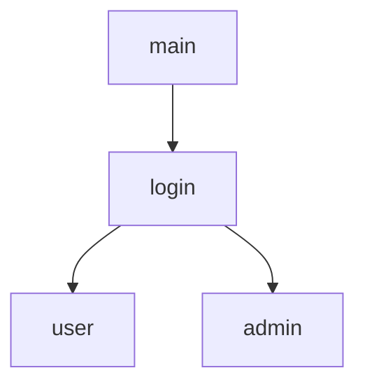

출근 10:00
- 오늘은 Kmap 본격적으로 개발 시작하는 날
Login UI를 내가 만들 예정

일단 Kmap 띄우고 프로젝트 내부를 분석함
1차 당황 : 음? 프론트가 `js`가 아니라 `type-script`를 사용하네? (내가 공부한건 `js`기반인데?)

14:00에 랩실 뉴비들끼리 모여서 회의함

이렇게 로그인 화면을 분할하는 게 좋을 것 같다
(ref. 14세 미만 계정)

우선 로그인 UI를 먼저 만들었다
![[Pasted image 20260119162225.png]]
그리고 PR을 올렸다

AI Review가 왔다
> [!r] Code Review
> ### Summary
> 관리자 로그인 페이지 UI 구현 및 Header 컴포넌트 통합. 랜딩 페이지와 일관된 디자인 적용.
> 
> ### Issues
> **`frontend/src/pages/AdminPage.css:1`**
> - CSS 파일 분리가 프로젝트 패턴과 불일치. 기존 컴포넌트들은 Tailwind CSS를 사용하며 별도 CSS 파일을 생성하지 않음
> ```typescript
> // 기존 패턴 (Header.tsx, LandingPage.tsx)
> <div className="min-h-screen bg-background flex flex-col">
> ```
>
> **`frontend/src/pages/AdminPage.tsx:7-9`**
> - 사용되지 않는 상태 변수들. `username`, `password`는 폼 제출 후 초기화되지 않음
>
> **`frontend/src/pages/AdminPage.tsx:17-19`**
> - 하드코딩된 지연시간과 임시 구현. 실제 API 연동 없이 항상 성공 처리
>
> **`frontend/src/pages/AdminPage.css:23-24`**
> - CSS 변수 사용이 일관되지 않음. `var(--card)`를 사용하지만 다른 곳에서는 `var(--color-background)` 사용
>
> ### Suggestions
>
> **`frontend/src/pages/AdminPage.tsx:전체`**
> - CSS 모듈 대신 Tailwind CSS로 스타일링하여 프로젝트 일관성 유지
> ```typescript
>const AdminPage: React.FC = () => {
> return (
>    <div className="min-h-screen bg-card flex flex-col relative overflow-hidden">
>      <Header />
>      <div className="bg-dot-pattern absolute inset-0 top-16 animate-drift" />
>      <div className="relative z-10 flex-1 flex items-center justify-center p-5">
>        <div className="w-full max-w-md bg-background rounded-lg shadow-lg border p-8">
>          {/* 로그인 폼 */}
>        </div>
>      </div>
>    </div>
>  );
>};
>```
>
> **`frontend/src/components/Layout/Header.tsx:40-44`**
> - 버튼 텍스트와 경로의 불일치. "Log In"이지만 `/admin` 경로로 이동
> ```typescript
> <Link to="/admin">
>   <Button className="...">
>    Admin
>  </Button>
> </Link>
>```
>
> **`frontend/src/pages/AdminPage.tsx:17`**
> - 실제 API 서비스 연동 준비
> ```typescript
> import { adminService } from '../services/api';
>
>const handleSubmit = async (e: React.FormEvent) => {
>  e.preventDefault();
>  setError(null);
>  setIsLoading(true);
>
>  try {
>    await adminService.login({ username, password });
>    // 성공 후 리다이렉트
>  } catch (err) {
>    setError("로그인에 실패했습니다.");
>  } finally {
>    setIsLoading(false);
>  }
>};
>```

이에 대한 나의 Comment는 다음과 같다
> [!ㅁ] 내 Comment
> - CSS 패턴은 고칠 예정 
> 하드 코딩된 부분은 API 연동이 아직 이루어지지 않았기 때문에 API연동이 이루어진 후에 고쳐질 예정
> router에서 `/login`으로 되어있는 부분은 어드민 전용 로그인이라서 그렇습니다 추가 설명에 나와있듯 추후에 로그인 화면 분할하는 것은 어떤지 제안 (ref. 14세 미만 어린이 계정)

그래서 CSS만 `Tailwind CSS` 방식을 활용하게 수정할 거임

그리고 지금은 PR 올리고 기다리는 중임

---

이제 총학 웹사이트 만들거임
여기도 Login 시스템임...ㅋㅋㅋㅋ...
이제 드디어 backend를 연결할 시간임
오늘 회원가입 기능을 끝낼 예정

---

근데 갑자기 다시 회의가 열림
관리자 페이지 frontend를 서브도메인으로 분리하기로 함
그리고 프로젝트 여러가지 개념들 다시 재정의함


### 오늘의 메모
---
나의 업무 도우미 AI에게 오늘 15만원을 갖다 바쳤다
덕분에 텅장이 되었다
덕분에 오늘 저녁은 공기다
다이어트...:)
하루 한끼 생활 들어간다....ㅋㅋ...